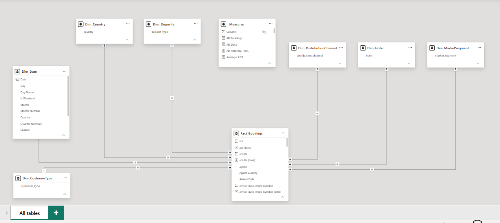

# 🏨 Hotel Booking Performance | Power BI End to End Data Analysis Project

This project presents an end-to-end Business Intelligence solution built in Power BI to analyze hotel booking performance using the Hotel Booking Demand Dataset, which contains over 119,000 hotel reservations from both a City Hotel and a Resort Hotel in Portugal between 2015 and 2017.
The primary objective of this project was not only to build interactive dashboards, but also to perform a complete analytical workflow starting from raw data investigation, data cleaning, feature engineering, data modeling, DAX development, business analysis, and finally transforming the results into actionable business insights.
Throughout the project, significant attention was given to understanding the business behind the data rather than simply visualizing numbers. Every KPI, visualization, and metric was designed to answer a real business question that hotel management could use for decision making.

## The dashboard is divided into three analytical pages:

- Overview: Provides an executive summary of the hotel's overall performance, including revenue, bookings, cancellations, hotel comparison, market segments, seasonality, countries, and reservation outcomes.

- Performance Drivers: Investigates the factors that directly influence revenue generation and booking cancellations, such as lead time, booking behavior, stay duration, ADR, special requests, and seasonal cancellation trends.

- Customer Analysis: Focuses on customer behavior by analyzing customer types, market segments, repeated guests, family bookings, customer value, and cancellation patterns across different customer groups.

## 🎯 Business Problem

The hotel management team needs a data driven solution to monitor booking performance, reduce revenue loss, and better understand customer behavior.

This dashboard was designed to answer key business questions, including:

- Why are customers cancelling their bookings?
- How much revenue is lost because of cancellations?
- Which market segments generate the highest revenue?
- Which customer types are the most valuable?
- Which seasons contribute the most revenue?
- Which countries generate the largest share of bookings and revenue?
- What operational factors increase the likelihood of cancellation?
- How can these insights support better revenue and booking management decisions?

## 📂 Dataset

This project is based on the **Hotel Booking Demand Dataset**, a real-world hotel reservation dataset containing historical booking records collected from both a **City Hotel** and a **Resort Hotel** in Portugal.

The dataset covers reservations scheduled between **July 2015 and August 2017**, providing detailed information about booking behavior, customer characteristics, reservation channels, stay duration, pricing, and cancellation history.

| Dataset Information | Value |
|---------------------|-------|
| **Dataset** | Hotel Booking Demand Dataset |
| **Source** | Kaggle |
| **Records** | 119,390 |
| **Features** | 32 Columns |
| **Hotels** | City Hotel & Resort Hotel |
| **Period** | July 2015 – August 2017 |

The dataset contains a wide range of business-related attributes including:

- Booking Information
- Customer Demographics
- Reservation Details
- Stay Information
- Revenue & Pricing
- Distribution Channels
- Market Segments
- Special Requests
- Cancellation Status

## 🧹 Data Cleaning & Preparation

Before starting the analysis, a complete data preparation process was performed to ensure data quality, consistency, and reliable business insights.

The following cleaning and transformation steps were applied:

- Removed unrealistic outliers (e.g., **Adults = 55**).
- Removed invalid negative **ADR** values.
- Investigated missing values across all features instead of blindly removing records.
- Filled missing **Country** values with **"Unknown"** to preserve observations.
- Evaluated **Agent** and **Company** missing values and retained them after business validation.
- Standardized categorical values for consistency.
- Created business-friendly labels for reservation status.
- Created **Family / Non-Family** customer classification.
- Created **Repeated / New Guest** classification.
- Created **Total Nights** feature by combining weekday and weekend stays.
- Created **Total Revenue** feature using ADR × Total Nights.
- Created a dedicated **Date Dimension** to support Time Intelligence calculations.
- Prepared the dataset for Star Schema modeling and Power BI reporting.

## 🔍 Data Quality Investigation

During the exploratory data analysis phase, several data quality issues and business anomalies were identified and carefully investigated before building the final dashboard.

Instead of applying generic cleaning techniques, every issue was analyzed based on its business impact and analytical validity.

### 1. Missing Country Values

**Issue**

- 488 missing values (**0.41%** of the dataset).

**Investigation**

The percentage of missing records was extremely small and removing them would unnecessarily reduce the available observations.

**Decision**

- Replaced missing values with **"Unknown"**.
- Preserved all booking records.
- Prevented unnecessary data loss while maintaining reporting consistency.

---

### 2. Agent & Company Missing Values

**Issue**

Large numbers of missing values were found in both **Agent** and **Company** columns.

**Investigation**

Business analysis showed that these missing values do not necessarily represent poor data quality. Many direct bookings naturally have no travel agent or company associated with them.

**Decision**

- Retained both columns.
- Avoided replacing or deleting values without business justification.

---

### 3. Invalid Numerical Values

**Issue**

Several unrealistic numerical values were detected.

Examples included:

- Adults = **55**
- Negative ADR values

**Decision**

- Removed impossible observations.
- Eliminated invalid pricing records before calculating business KPIs.

---

### 4. Deposit Type Investigation

One of the most important findings during the project was the unusually high cancellation rate for **Non Refundable** bookings, which approached **99%**.

At first glance, this result appeared illogical since non refundable bookings are generally expected to discourage cancellations.

A detailed investigation was conducted, including reviewing the dataset documentation.

The analysis revealed that:

- Deposit Type is partially generated using PMS transaction records.
- The feature contains **Target Leakage** for predictive modeling.
- A significant portion of these bookings belongs to **Tour Operators** and **Group Reservations**.
- Large room blocks are frequently cancelled together as part of wholesale booking operations rather than individual customer behavior.

**Business Decision**

- Deposit Type was **not used** to derive business recommendations related to customer cancellation behavior.
- The anomaly was documented as a known data limitation rather than treated as a customer behavior insight.

---

### Data Quality Methodolgy

All cleaning and validation decisions were driven by business understanding rather than simply removing missing values or outliers.

Every modification was validated to preserve analytical integrity and ensure that the final dashboard reflects real business performance rather than distorted data.

## 🗂️ Data Model

A **Star Schema** data model was implemented to ensure high performance, scalability, and clean business reporting.

### Data Model Overview

## 📐 DAX Measures

To support business reporting and executive decision making, a complete set of reusable DAX measures was developed and organized into logical business categories.

| Category | Measures |
|----------|----------|
| **Revenue** | Total Revenue, Lost Revenue, All Potential Revenue, Revenue Per Booking, Revenue vs. Loss |
| **Bookings** | All Bookings, Confirmed Bookings, Cancelled Bookings, Cancellation Rate |
| **ADR** | Average ADR, Median ADR |
| **Lead Time** | Average Lead Time, Median Lead Time |
| **Stay Analysis** | Average Stay, Median Stay |
| **Customer Analysis** | Repeated Guests, Repeated Rate, Family Bookings, Family Rate |
| **Special Requests** | Average Requests |

### DAX Highlights

The measures were designed following Power BI best practices by:

- Using reusable measures instead of duplicated calculations.
- Leveraging Time Intelligence functions for year over year analysis.
- Separating business KPIs into logical categories.
- Building scalable calculations that can be reused across multiple report pages.

> 📄 The complete DAX library is available in **`DAX_Measures.txt`**.

## 📊 Key Business Insights

The exploratory analysis and dashboard revealed several important business findings:

### 💰 Revenue Performance

- **City Hotel** generated the majority of total revenue, contributing approximately **55%** of overall hotel revenue.
- Revenue was heavily concentrated in a limited number of customer segments, indicating clear revenue driving markets.
- Summer months represented the strongest revenue period across both hotels.

---

### 📅 Booking Behavior

- Longer **Lead Time** was strongly associated with a higher probability of booking cancellation.
- Confirmed bookings significantly outperformed cancelled bookings in total revenue generation.
- A substantial amount of potential revenue was lost due to booking cancellations.

---

### 👥 Customer Insights

- Family and repeated guests represented only a relatively small portion of total bookings.
- Customer behavior differed significantly across customer types and market segments.
- Certain customer segments consistently generated higher booking value than others.

---

### 🌍 Market Performance

- Online Travel Agencies (OTA) represented one of the largest booking sources.
- Revenue contribution varied considerably across countries and market segments.
- Booking channels showed clear differences in cancellation behavior.

---

### ⚠️ Operational Findings

- The **Deposit Type** variable showed an unusually high cancellation rate (~99% for Non Refund bookings).
- Detailed investigation confirmed that this behavior was caused by PMS extraction logic, wholesale group bookings, and target leakage rather than actual customer behavior.
- Therefore, Deposit Type was documented as a data limitation and excluded from customer behavior recommendations.

---

### 📈 Overall Business Impact

The analysis provides hotel management with actionable insights to:

- Reduce booking cancellations.
- Improve revenue management strategies.
- Optimize customer targeting.
- Identify high-value customer segments.
- Improve forecasting and operational planning.

## 💡 Business Recommendations

Based on the analysis, the following recommendations are proposed:

### 🎯 Revenue Optimization

- Prioritize revenue optimization strategies for **City Hotel**, as it contributes the largest share of total revenue.
- Focus marketing efforts on the customer segments and booking channels generating the highest revenue.

---

### ❌ Cancellation Reduction

- Closely monitor bookings with long **Lead Time**, as they exhibit a significantly higher cancellation tendency.
- Implement reminder campaigns or flexible re-confirmation strategies for high lead-time reservations.
- Build a cancellation risk monitoring dashboard to support proactive intervention.

---

### 📈 Seasonal Planning

- Increase room inventory planning and dynamic pricing during high-demand seasons.
- Prepare staffing and operational resources based on seasonal booking patterns.

---

### 🌍 Market & Channel Strategy

- Continuously evaluate booking channel performance based on both revenue contribution and cancellation behavior.
- Allocate marketing budgets toward the most profitable acquisition channels rather than the highest booking volume alone.

---

### 🏨 Revenue Management

- Monitor Lost Revenue as a strategic KPI to evaluate the financial impact of cancellations.
- Use Revenue, ADR, Occupancy, and Cancellation metrics together when evaluating hotel performance rather than relying on a single KPI.

---

### ⚠️ Data & Business Considerations

- The **Deposit Type** variable should **not** be interpreted as evidence that Non-Refundable policies increase cancellations.
- The observed anomaly was caused by PMS extraction logic, wholesale group bookings, and target leakage.
- Future business decisions regarding deposit policies should rely on operational data rather than this historical artifact.

## 📌 Conclusion

This project showcases a complete end to end Power BI Business Intelligence solution, transforming raw hotel booking data into meaningful business insights and executive dashboards.

By combining data cleaning, data modeling, DAX, and business-driven analytics, the report provides actionable insights that support revenue optimization, customer analysis, and strategic decision-making.